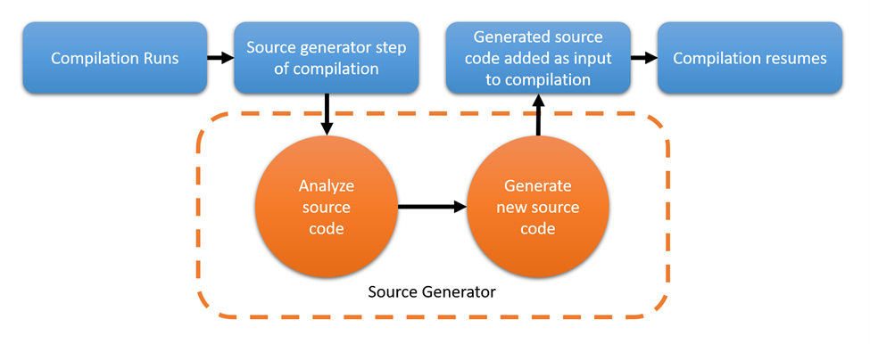

# 1. 入门
## 命名规则
1. 命名空间、类、函数、接口、属性等命名，使用Pascal名法，如：`MyClass`、`MyFunction`、`MyProperty`。
2. 变量、参数、方法、事件等命名，使用Camel名法，如：`myVariable`、`myMethod`。
3. 派生类末尾使用基类名，如：`MyClassBase`、`MyClassDerived`。
4. 文件夹命名，采用Pascal名法，如：`MyFolder`。
5. 适当增加空行
- 两行空行：同一文件的不同部分之间；类、接口、结构体、枚举等成员之间；
- 一行空行：方法之间；局部变量和它后面的语句之间；方法内部功能逻辑之间；
6. 避免使用大文件：一个文件不要超过300-400行，一个方法不要超过25行。
7. 一个方法只做一件事情，即使这些任务非常小。
8. 多使用region和endregion

# 2. 数据类型
1. 值类型：存储在栈中，直接包含数据。隐式派生自`System.ValueType`。
- 基本类型：整型、浮点型、布尔型、字符型
- 结构类型：结构体
- 枚举类型
2. 引用类型：存储在堆中，包含指向数据的引用
- 类类型
- 接口类型
- 委托类型
- 数组类型
3. 类型转换
- 隐式转换，显示转换
- Convert转换，来自库 `System.Convert`
4. **装箱和拆箱**
- 装箱：将值类型转换为引用类型
- 拆箱：将引用类型转换为值类型
```csharp
int i = 123;
object o = i; // 装箱,任何值类型都可以隐式地转换为object类型
Console.WriteLine(o);
int j = (int)o; // 拆箱，把一个object类型显示转换为值类型

```
----
decimal: 128位精确的十进制值，28-29位的有效数字，适用于金融计算
```csharp
decimal d = 2.718 M;
```
# 3. 异常

```csharp 
//自定义异常
try
{
    throw new MyException("MyException");
}
catch (MyException e)
{
    Console.WriteLine(e.Message);
}

public class MyException : Exception
{
    public MyException(string message) : base(message)
    {
    }
}
```
# 4. 常见数据类型
1. 字符串
- 字符串判等：`==`、`Equals`、`CompareTo`
- 字符串包含：`Contains`、`StartsWith`、`EndsWith`
- 字符串查找：`IndexOf`、`LastIndexOf`
- 字符串取子串：`Substring`
- 字符串插入：`Insert`
- 字符串删除：`Remove`
- 字符串替换：`Replace`
- 字符串去除空格：`Trim`去除头部和尾部、`TrimStart`、`TrimEnd`
- 每次改变String对象的值，都需要在内存中重新分配空间，内存开销比较大。

  StringBuilder类没有这个问题。

  StringBuilder 减少了内存分配次数： StringBuilder 在操作字符串时并不每次都分配新的内存，而是维护一个可调整大小的字符数组。
  只有当字符数组的容量不足时，StringBuilder 才会分配更大的数组，这样可以避免频繁的内存分配和垃圾回收。

  StringBuilder 减少了中间对象的创建： 当使用 String 拼接字符串时，每次都会生成新的字符串对象，
  这些临时对象最终都会被垃圾回收。但使用 StringBuilder 时，只有一个对象会被反复修改，不会创建多余的中间字符串对象。
2. 数组
- 数组是引用类型，派生自`System.Array`。
- 数组字符串相互转化：`string.Join(分隔符,array)`、`string.Split(分隔符)`
```csharp

//遍历二维数组，先行后列
int [,] array = new int[3,3]{{1,2,3},{4,5,6},{7,8,9}};
foreach (var item in array)
{
    Console.WriteLine(item);
}
```

# 5. 类
类的成员：主要包括描述状态的数据成员和描述操作的函数成员。
- 方法重载、重写、隐藏
    - 重载：方法名相同，参数列表不同
    - 重写：基类和派生类中有同名的方法，派生类中的方法会覆盖基类中的方法,需要使用`override`关键字
    - 隐藏：基类和派生类中有相同的方法，派生类中的方法会隐藏基类中的方法，多了一个`new`关键字
```csharp
//代码示例
public class Base
{
    public virtual void Dispalay()
    {
        Console.WriteLine("Base.Dispalay");
    }

    public void Show()
    {
        Console.WriteLine("Base.Show");
    }

}

public class Derived : Base
{
    public override void Method()      //重写
    {
        Console.WriteLine("Derived.Method");
    }

    public new void Show()             //隐藏
    {
        Console.WriteLine("Derived.Show");
    }
}

```
## 抽象类和接口
- 接口是一种抽象的类型，只包含成员的声明，不包含成员的实现。
- 抽象类是一种抽象的类型，可以包含成员的声明和实现。需要使用`abstract`关键字。
- 密封类：使用`sealed`关键字，不能被继承。
```csharp
//代码示例
public interface IMyInterface
{
    void Show();
}

public abstract class MyAbstractClass
{
    public abstract void Display();
}

public sealed class MySealedClass
{
    public void Show()
    {
        Console.WriteLine("MySealedClass.Show");
    }
}
```
## 委托和事件
- 委托是一种类型，用于引用方法。委托类型的变量可以指向一个方法。
- 事件是一种特殊的委托，用于通知其他对象发生了某个动作。
- 
```csharp
class Test
{
    public static bool SortArray(int[] array)
    {
        Array.Sort(array);
        return true;
    }
}

class Program
{
    public delegate bool SortArrayDelegate(int[] array);
    static void Main(string[] args)
    {
        int[]array = new int[] { 1, 2, 4, 3, 5 };
        Console.WriteLine("排序前的元素是{0}",string.Join(",",array));
        SortArrayDelegate sortArrayDelegate = new SortArrayDelegate(Test.SortArray);
        bool result = sortArrayDelegate(array);
        Console.WriteLine("排序后的元素是{0}", string.Join(",", array));
    }
}

//事件
Heater heater = new Heater();
Alarm alarm = new Alarm();
heater.BoilEvent += alarm.MakeAlert;
heater.BoilEvent += Display.ShowMsg;
heater.BoilWater();
//事件代码示例
class Heater
{
    private int temperature;
    public delegate void BoilHandler(int param);
    public event BoilHandler? BoilEvent;

    public void BoilWater()
    {
        for (int i = 0; i < 100; i++)
        {
            temperature = i;
            if (temperature > 96)
            {
                if (BoilEvent != null)
                {
                    BoilEvent(temperature);
                }
            }
        }
    }
}

public class Alarm
{
    public void MakeAlert(int param)
    {
        Console.WriteLine("Alarm: 滴滴滴滴，水已经烧开，温度{0}", param);
    }
}

public class Display
{
    public static void ShowMsg(int param)
    {
        Console.WriteLine("Display: 水快烧开了，当前温度{0}", param);
    }
}
```

An event is a specialized delegate used to implement the observer pattern, where an event allows a class (event sender) to notify other classes (event receivers) when something happens. Events ensure that the sender class cannot directly invoke methods of the receiver class, and only the receiver can subscribe to or unsubscribe from events.

1. Delegates: A delegate is just a reference to a method, and you can invoke the delegate directly.
2. Events: An event is a specialized form of a delegate designed to encapsulate the publish-subscribe pattern. You cannot directly invoke an event outside of its defining class; it must be raised from within the class that defines the event.
# 6. 泛型
泛型集合与非泛型集合的对比

特性 | 泛型集合 (Generic) | 非泛型集合 (Non-Generic)
--- | --- | ---
类型安全 | 类型安全，在编译时进行类型检查 | 不安全，存储为 object 类型，需要显式转换
性能 | 提供更好的性能，不需要装箱和拆箱 | 性能较差，尤其是对于值类型，涉及装箱和拆箱
可读性和简洁性 | 更简洁且易于理解，不需要手动类型转换 | 需要显式的类型转换，增加代码复杂度
适用场景 | 当你知道集合中元素的类型时，推荐使用泛型集合 | 当你需要存储多种不同类型的对象时，使用非泛型集合

非泛型集合
- **ArrayList**：一个动态数组，元素可以是任何类型（通过 `object` 类型实现）。
- **Hashtable**：存储键值对的集合，键和值都可以是任何类型。
- **Queue**：非泛型队列，元素可以是任何类型。
- **Stack**：非泛型栈，元素可以是任何类型。
- **SortedList**：非泛型排序字典，键和值可以是任何类型。

泛型集合
- **List<T>**：动态数组，支持按索引访问元素，可以增、删、改、查元素。
- **Dictionary<TKey, TValue>**：字典集合，存储键值对，可以通过键快速查找对应的值。
- **Queue<T>**：队列集合，先进先出（FIFO）的数据结构。
- **Stack<T>**：栈集合，先进后出（LIFO）的数据结构。
- **HashSet<T>**：哈希集合，不允许重复的元素。
- **LinkedList<T>**：链表集合，元素之间通过指针连接。
```csharp
//Generic Collections
List<int> numbers = new List<int>();
numbers.Add(1); // Valid
// numbers.Add("Hello"); // Compile-time error: cannot add string to List<int>

//Non-Generic Collections
ArrayList list = new ArrayList();
list.Add(1); // Valid
list.Add("Hello"); // Valid, but can cause issues later


//Generic Collections
Dictionary<string, int> map = new Dictionary<string, int>();
map["apple"] = 5;  // Clearly tells you the key is a string and value is an int

//Non-Generic Collections
Hashtable map = new Hashtable();
map["apple"] = 5; // Key is object, value is object
int value = (int)map["apple"];  // Requires explicit casting
 
```

IComparable<T> 和 IComparer<T> 的区别

| 特性         | IComparable<T>                | IComparer<T>                          |
|--------------|-------------------------------|---------------------------------------|
| 目的         | 定义类的自然排序规则          | 提供外部比较器，可以自定义排序规则   |
| 方法         | CompareTo(T other)            | Compare(T x, T y)                     |
| 适用场景     | 类内部需要自己定义排序逻辑    | 在排序时需要传入外部定义的比较规则   |
| 使用方式     | 被比较的类实现接口并定义比较逻辑 | 外部类实现接口并定义比较逻辑         |
| 修改类的代码 | 需要修改类的代码              | 无需修改类的代码，可以独立创建比较器 |

```csharp
public class Person
{
    public string Name { get; set; }
    public int Age { get; set; }
}

// 实现 IComparer<T> 接口，用来按名字排序
public class NameComparer : IComparer<Person>
{
    public int Compare(Person x, Person y)
    {
        if (x == null && y == null) return 0;
        if (x == null) return -1;
        if (y == null) return 1;
        return string.Compare(x.Name, y.Name);
    }
}

class Program
{
    static void Main()
    {
        List<Person> people = new List<Person>
        {
            new Person { Name = "Alice", Age = 30 },
            new Person { Name = "Bob", Age = 25 },
            new Person { Name = "Charlie", Age = 35 }
        };

        // 使用自定义的 NameComparer 排序
        people.Sort(new NameComparer());
        foreach (var person in people)
        {
            Console.WriteLine($"{person.Name}, {person.Age}");
        }
    }
}
```

```csharp
public class Person : IComparable<Person>
{
    public string Name { get; set; }
    public int Age { get; set; }

    // 实现 CompareTo 方法，按年龄排序
    public int CompareTo(Person other)
    {
        if (other == null)
            return 1;  // 如果 other 是 null，当前对象排在后面

        return this.Age.CompareTo(other.Age);  // 按年龄进行比较
    }
}

class Program
{
    static void Main()
    {
        List<Person> people = new List<Person>
        {
            new Person { Name = "Alice", Age = 30 },
            new Person { Name = "Bob", Age = 25 },
            new Person { Name = "Charlie", Age = 35 }
        };

        people.Sort();  // 使用 IComparable<T> 实现的排序
        foreach (var person in people)
        {
            Console.WriteLine($"{person.Name}, {person.Age}");
        }
    }
}
```

特性 | FileStream | StreamReader
--- | --- | ---
数据类型 | 二进制数据（byte[]） | 文本数据（string）
用途 | 低级别字节流操作 | 高级别文本读取操作
适用场景 | 二进制文件（图片、视频等），大型文件操作 | 文本文件（如 .txt, .csv, .json）
操作类型 | 读写字节数据 | 逐行读取文本数据
编码管理 | 手动管理（需自行处理编码） | 自动处理字符编码（如 UTF-8）
性能 | 更高效，适用于高性能文件操作 | 适用于处理文本文件，略逊于 FileStream
常见方法 | Read, Write, Seek | ReadLine, ReadToEnd


特性 | XmlDocument | DataSet | LINQ to XML (XDocument)
--- | --- | --- | ---
操作方式 | 节点操作，DOM 树结构 | 数据表格化操作（表格、行、列） | LINQ 查询方式，基于流式 API
适用场景 | 复杂的 XML 文件操作，涉及多层嵌套和复杂结构 | 适用于表格结构化的 XML 数据，数据表格化操作 | 简洁、高效地处理 XML 数据，适用于小到中等规模的 XML
内存开销 | 较高，加载整个文档到内存 | 较高，加载整个数据集到内存 | 较低，流式加载，适合处理大文件
灵活性 | 非常灵活，支持复杂的节点增删改查操作 | 支持数据表、关系、约束等复杂的数据结构操作 | 简洁、易于使用，支持 LINQ 查询
性能 | 性能较低（对大型 XML 文件较慢） | 性能较低（处理大型数据集时较慢） | 性能较高，适合处理大文件，支持延迟加载
操作复杂度 | 相对复杂，需要处理 XML 节点 | 使用 DataTable，表格操作，API 更加简单 | 简单，使用 LINQ 查询语法，易于理解和操作

选择合适的方式：
- **XmlDocument**：适用于复杂的 XML 文档操作，特别是需要增删改查节点的场景。
- **DataSet**：适用于将 XML 数据转换为表格结构进行处理，尤其是处理关系型或扁平化的 XML 数据。
- **LINQ to XML**：适用于需要简洁查询和操作的 XML 数据，尤其是在处理中小型 XML 文件时，LINQ 提供了更好的可读性和简洁性。

# 反射（Reflection）

Reflection in C# is a powerful feature that allows you to inspect and interact with types, methods, properties, fields, and other metadata at runtime. This enables a program to analyze its own structure, create instances of types, invoke methods, and access fields or properties dynamically, even if they are not known at compile time.

## 1. 反射的主要用途
- **动态创建对象**：可以在运行时通过反射动态创建对象实例。
- **访问类型信息**：允许查询对象的元数据（如类、方法、属性、字段等），而无需在编译时已知类型。
- **动态调用方法和属性**：通过反射，程序可以在运行时动态调用方法或访问属性。
- **动态加载程序集**：反射允许程序加载和使用未在编译时显式引用的程序集。

## 2. 反射的核心类
- **`Type`**：包含类型的元数据信息，提供获取类型的成员和方法。
- **`MethodInfo`**：代表类型中的方法。
- **`PropertyInfo`**：代表类型中的属性。
- **`FieldInfo`**：代表类型中的字段。
- **`Assembly`**：代表程序集，用于加载和访问程序集中的类型。
- **`ConstructorInfo`**：代表类型的构造函数。

## 3. 反射的常见操作

### (1) 获取类型信息
使用 `Type` 类，可以获取对象或类型的元数据。
```csharp

using System;
using System.Reflection;

public class Person
{
    public string Name { get; set; }
    private int Age { get; set; }

    public void SayHello()
    {
        Console.WriteLine("Hello, " + Name);
    }

    private void SetAge(int age)
    {
        Age = age;
    }
}

// Creating an instance of Person using Reflection
Type type = typeof(Person);
object personInstance = Activator.CreateInstance(type);

// Get all public properties
Console.WriteLine("Public Properties:");
PropertyInfo[] publicProperties = type.GetProperties();
foreach (var property in publicProperties)
{
    Console.WriteLine($"Property: {property.Name}");
}

// Get all methods, including private
Console.WriteLine("\nMethods:");
MethodInfo[] methods = type.GetMethods(BindingFlags.Public | BindingFlags.NonPublic | BindingFlags.Instance);
foreach (var method in methods)
{
    Console.WriteLine($"Method: {method.Name}");
}

// Accessing and setting property using reflection
PropertyInfo nameProperty = type.GetProperty("Name");
nameProperty.SetValue(personInstance, "Alice");

// Calling a method using reflection
MethodInfo sayHelloMethod = type.GetMethod("SayHello");
sayHelloMethod.Invoke(personInstance, null); // Output: Hello, Alice
```

# C#编码插件
可以通过Polygot打开类似jupyter notebook.

